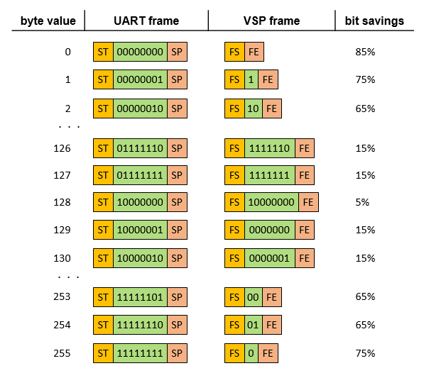
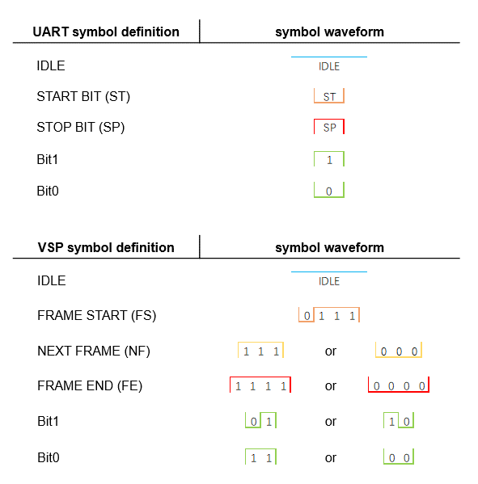
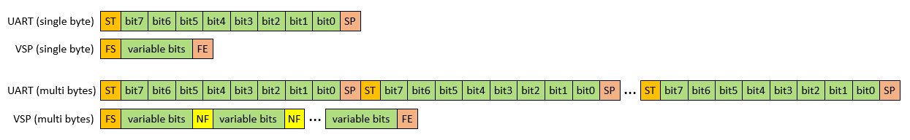
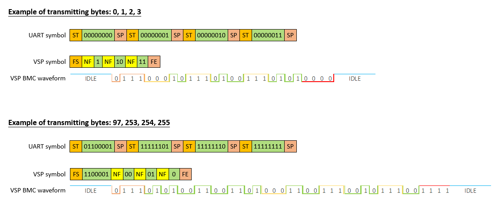

# VARIABLE SERIAL PORT
A new serial port (VSP) for data communication, can save transmission time from `5% up to 85%`, and support much faster bit rate comparing to UART.
 
## How it works
It is done by only transmitting the meaningful bits, and omit all the redundant leading zeros of a byte. This is the most different portion of VSP comparing with UART. UART transmits value in fixed 8-bit binary bits, but VSP transmits value in variable-bit binary bits. For example: 
- When transmitting a byte value `2`, UART will transmit the `2` in this way: `start 00000010 stop`. But for VSP, it will transmit like this: `start 10 stop`. Hence save 6 bits (65% savings).
- In addition, when transmitting a byte value `253`, UART will transmit in this way: `start 11111100 stop`, while VSP will transmit like this: `start 00 stop`. Hence save 6 bits (65% savings). For details of how binary `00` can be used to represent decimal `253`, please see the illustration of Fig.1 below.


Fig.1 illustrates this mechanism:
<p align="center">
  
</p>
<p align="center">
 Fig.1, VSP bit savings comparing with UART
</p> <br /><br />


From Fig.1 you can see the savings of VSP varies on different value of a byte to be sent. Note that the saving calculation is based on assumption that long repeating bytes to be sent, and ignore the first `start bit` and last `stop bit` in UART / VSP, for example:<br />
<br />Sending long repeating byte value 0:
```
UART: start 00000000 stop, start 00000000 stop, start 00000000 stop, ... start 00000000 stop
VSP: FS NF,NF,NF,NF, ... NF,FE
Comparing 1.5bit "NF" from VSP and 10bit "00000000 stop, start" from UART, the saving for VSP is: (10-1.5)/10 = 85%
```

<br />Sending long repeating byte value 128:
```
UART: start 10000000 stop, start 10000000 stop, start 10000000 stop, ... start 10000000 stop
VSP: FS 10000000 NF, 10000000 NF, 10000000 NF, 10000000 NF, ... 10000000 NF FE
Comparing 9.5bit "10000000 NF" from VSP and 10bit "10000000 stop, start" from UART, the saving for VSP is (10-9.5)/10 = 5%
```


<br />When byte = 0, all the bits are omitted in VSP, and only a 1.5bit `NF` mark exist, hence the savings is `85% (largest savings)` compare with 10bit (8bits `0` + 1bit `start` + 1 bit `stop`) of UART.
When byte = 128, there is no savings on number of bits reduction, and the `5% (least savings)` savings is based on the 1.5bit `NF` marking, compare with 2bit `start + stop` of UART.

Start from byte value larger than 128, a coding method is applied to achieve bit reduction: 
```
byte = ~(256 - byte), where ~ means take NOT operation of the value
```
For example, for byte = 129, byte = ~(256 - 129) = ~127 = ~B1111111 = B0000000, where B means binary. So, seven bits: 0000000 is to be sent instead of eight bits: 10000001
For byte = 253,  `byte = ~(256 - 253) = ~3 = ~B11 = B00`, hence bit `FS + 00 + FE` is used to represent `FS + 11111100 + FE` in order to save bits. <br /> <br />


## Protocol
Similar to UART's `Start bit` and `Stop bit` symbols, VSP also defines `Start bit (Frame Start - FS)` and `Stop bit (Frame End - FE)` symbols for transmission start and stop marking. An addition marking `Next Frame (NF)` is introduced for distinguishing byte by byte when sending multi-bytes as shown in Fig.2.

<p align="center">
  
</p>
<p align="center">
 Fig.2, VSP symbol definition
</p> <br /><br /><br />                

<p align="center">
  
</p>
<p align="center">
 Fig.3, VSP frame format
</p> <br /><br /><br />

VSP deploys BMC (Biphase Mark Coding) format for signal sending. Fig.4 shows the actual BMC waveform of VSP for multi-bytes sending.
<p align="center">
  
</p>
<p align="center">
 Fig.3, VSP transmission waveform example
</p> <br /><br />


## Examples
Software example projects are done on both STM32G030F6 and STM32H750VB platforms for demonstrating the VSP transmission and reception features. Details on how to use the example projects please see `readme.txt`in the individual [`STM32G0_EXAMPLE`](https://github.com/maxmklam/VARIABLE_SERIAL_PORT/blob/main/STM32G0_EXAMPLE/readme.txt) and [`STM32H7_EXAMPLE`](https://github.com/maxmklam/VARIABLE_SERIAL_PORT/blob/main/STM32H7_EXAMPLE/readme.txt) folders.

For VSP transmission, two different approaches are taken: 
```
- Transmission by using SPI + DMA. In this approach the SPI MOSI pin is used to send out waveform in BMC format through DMA
- Transmission by using TIMER output compare + DMA. In this approach the TIMER output compare pin is used to send out waveform in BMC format through DMA
```

For VSP reception:
```
- Reception by using TIMER input capture + DMA. The BMC pulses are captured by TIMER input capture function through DMA, decode and recovered to raw data.
```

Theoretically, VSP can achieve clock rate as high as SPI. However, since in the software implementation, timer output comparing and input capture function is used for transmission and reception respectively, due to speed limitation on STM32 series timer input capture pin, the only clock rate can achieve is:
```
- VSP transmission and reception on 24Mbps clock rate (12Mbps bit rate) by using STM32H750VB
- VSP transmission and reception on 4Mbps clock rate (2Mbps bit rate) by using STM32G030F6
```

<br /><br />
## Works to do
- Support command sending from master to config the client, eg, operating speed, working mode etc.
- Single wire p2p bidirectional
- Single wire multi-master bidirectional
- Wireless p2p bidirectional
- Wireless multi-master bidirectional
- Huffman-coding-liked compression on transmission (good for large data transmission)
- Differential value for transmission (good for image/video data transfer)
- Single wire with fast DMA transmission for LCD 3-wire ppppSPI (ALL DMA, data + command, 8bit RAM use instead of 16bit)
- Single wire interface for LCD TDDI
  


